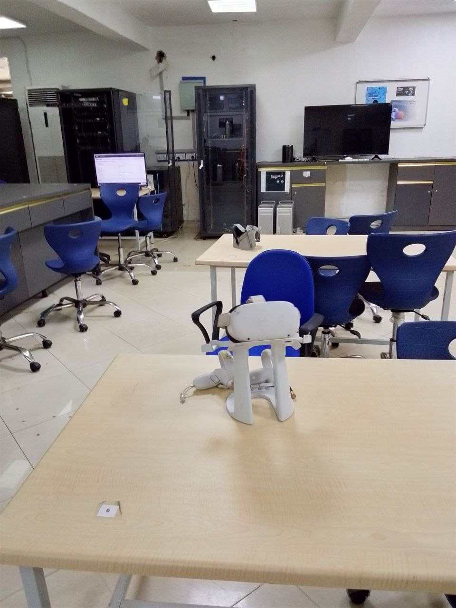
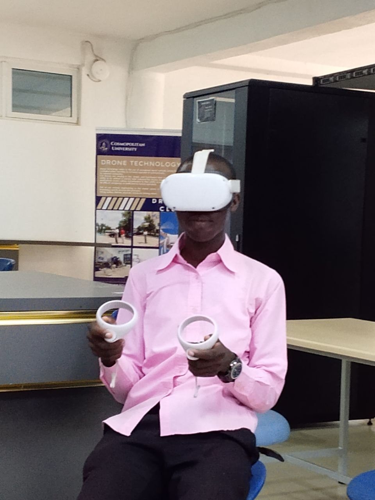

# Virtual Reality Training – Cosmopolitan University

## Overview
This repository contains my practical work and experience with Virtual Reality (VR) systems during my training at Cosmopolitan University.

The training focused on:
- VR environment interaction
- Immersive simulation systems
- VR headset usage
- Virtual object manipulation
- Real-time user interaction inside virtual spaces

## Technologies and Equipment Used
- VR Headset
- Motion Controllers
- VR Simulation Environment
- Unity-based VR System (if applicable)
- PC-Based VR Setup

## What I Learned
- Understanding immersive virtual environments
- User interaction inside VR spaces
- Motion tracking and controller integration
- VR simulation workflow
- Real-time rendering concepts

## Project Images

### VR Setup

### VR Interaction

### VR Other Images

## Video Demonstration
[Click here to watch the VR demonstration](https://youtube.com/shorts/MhGQdmCyZTA?feature=share)

